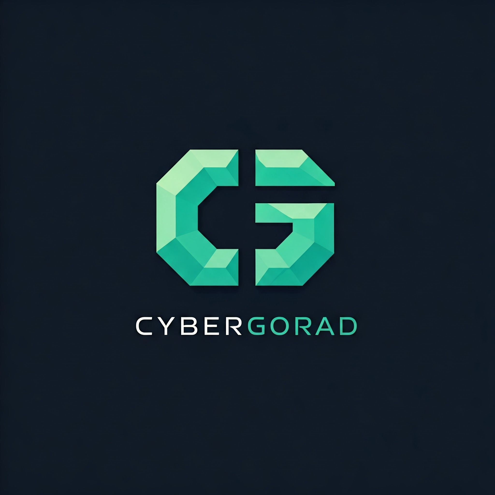

 👾 CYBERGORAD  

 🔗 Portfolio  
[](https://tsilavina.alwaysdata.net/portfolio)  

📌 Lien direct : [https://tsilavina.alwaysdata.net/portfolio](https://tsilavina.alwaysdata.net/portfolio)  


 # 🔗 Mes Offres

Explorez mes formations et services en cliquant sur le badge ci-dessous !  
Que vous soyez intéressé par la cybersécurité, le hacking éthique, ou des solutions personnalisées, je suis là pour répondre à vos besoins.

[](https://cybergorad.alwaysdata.net)

*📌 Lien direct : [https://cybergorad.alwaysdata.net](https://cybergorad.alwaysdata.net) 

---
[](https://github.com/your-username)


## 🚀 Projets et collaborations

🎯 **Travail en partenariat avec [cybeXus](https://github.com/cybeXus)**  
💡 Nous explorons les frontières de la cybersécurité avec des projets innovants, notamment : 
- 🔐 Développement d'outils d'analyse des vulnérabilités.
- 📊 Création de tableaux de bord de sécurité en temps réel.
- 🌐 Réseaux sécurisés pour des environnements complexes.


👉 Consulte nos contributions et nos projets : [cybeXus sur GitHub](https://github.com/cybeXus)

---


[](https://tsilavina.mywebcommunity.org)

[](tel:+261387581356)

[]([https://www.facebook.com/rakotoarivony.tsilavina](https://web.facebook.com/profile.php?id=100088633325455))

[](https://www.linkedin.com/in/rakotoarivony-tsilavina)


## 🛠️ Tech Stack





**PASSION**: HACKING.  
**MISSION**: EXPLORE. SECURE. BUILD.  
**STATUS**: ALWAYS LEARNING.  
**SKILLS**: CYBERSECURITY | NETWORKS | AUTOMATION.  

```bash
> INITIATING...  
> CONNECTED TO: CYBERGORAD'S NETWORK.  
> AUTHORIZED. WELCOME TO THE GRID.


